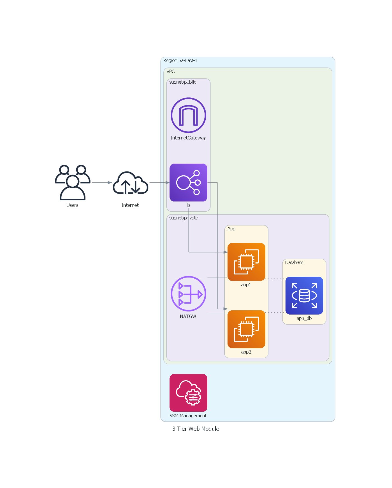

This project will follow this architecture design:

With this in mind, this project has the intention of doing the following:

- Terraform
    - [x] Create a VPC
        - [x] Private Subnets
        - [x] Public Subnets
        - [x] Internet Gateway
        - [x] Nat Gateway
    - [x] Create a RDS
        - [x] MySQL
        - [x] With Random Master Password
        - [x] Connection String in a Parameter Store
    - [x] Create an App
        - [x] In an Auto Scaling Group
        - [x] With ALB
        - [x] API that Connects to RDS
        - [x] Unique ID per Test
        - [x] SSM Policy in EC2
    - [x] Resource Group and Tagging
        - [x] Common Tags
        - [x] Specific tags merged with common ones
        - [x] Resource Group per App
- Testing
    - [x] Write Tests for VPC
        - [x] If subnet public is public
        - [x] If subnet private is private
    - [x] Write Tests for RDS
        - [x] If MySQL is the determined Version
        - [x] If endpoint is valid
        - [x] If the database was created
    - [x] Write Tests for SSM
        - [x] Check if command is valid
    - [x] Write Tests for ALB
        - [x] If Alb is responding
        - [x] If response body is expected
    - [x] Unite all Tests using `test_structure`